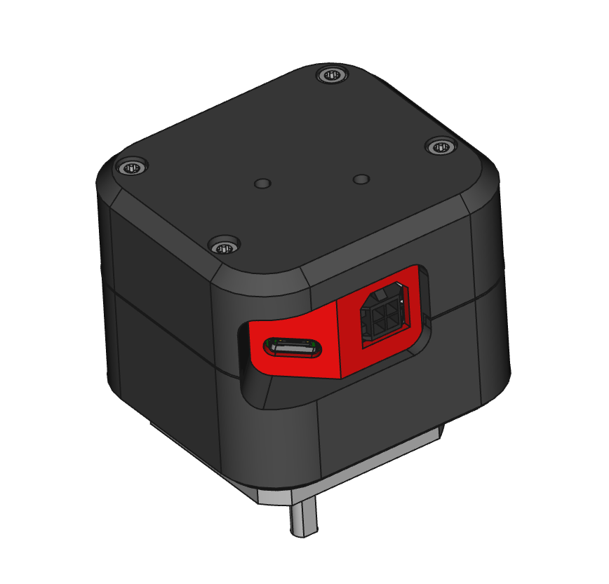
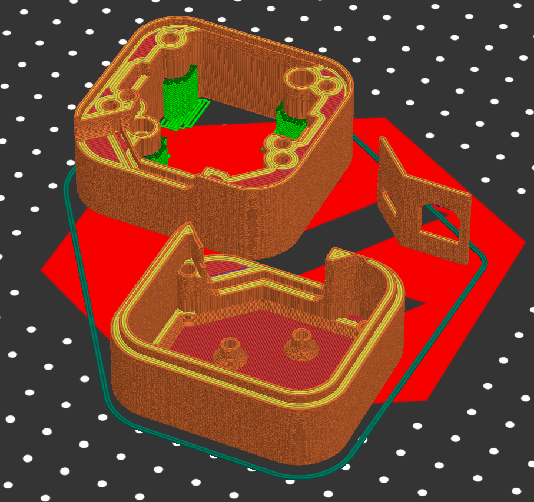
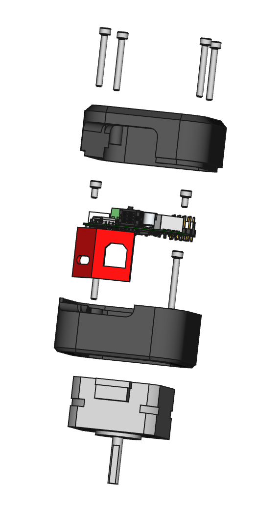
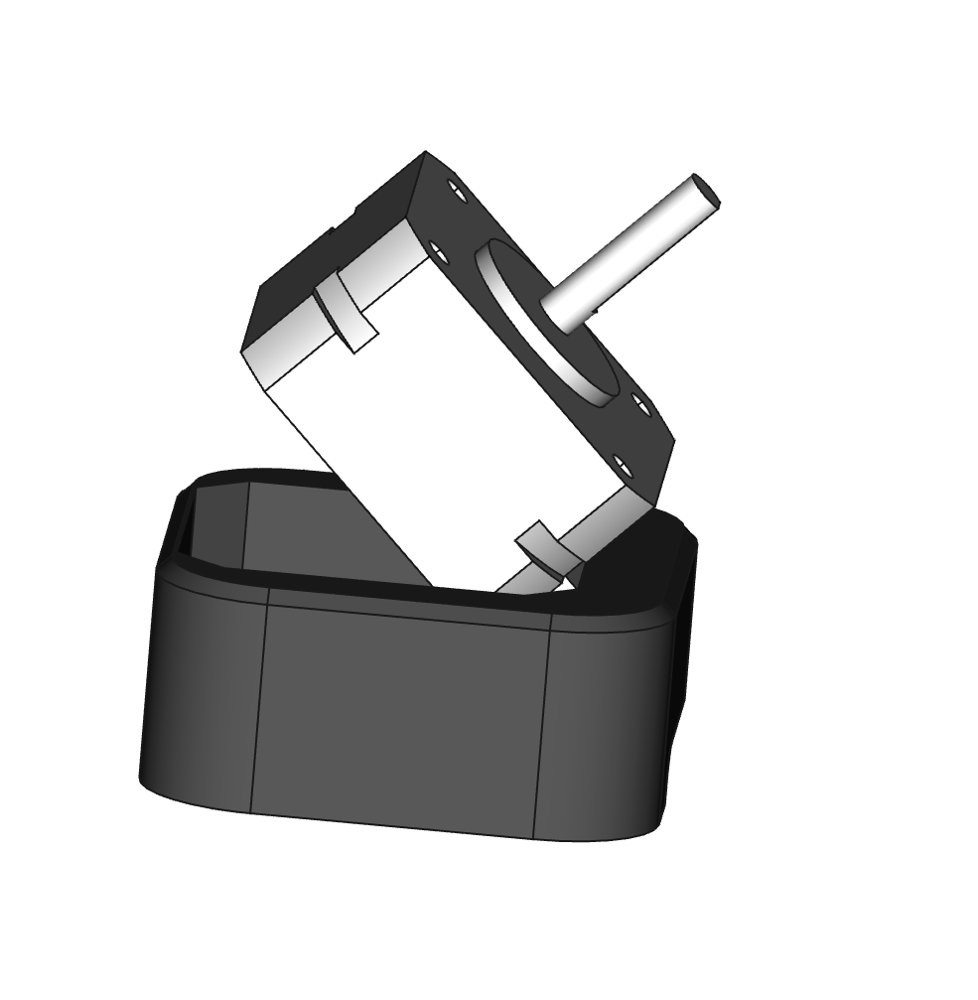
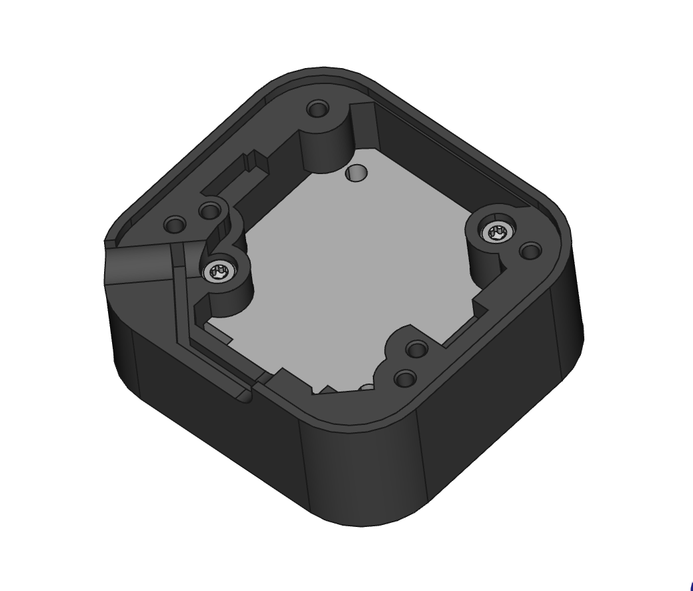
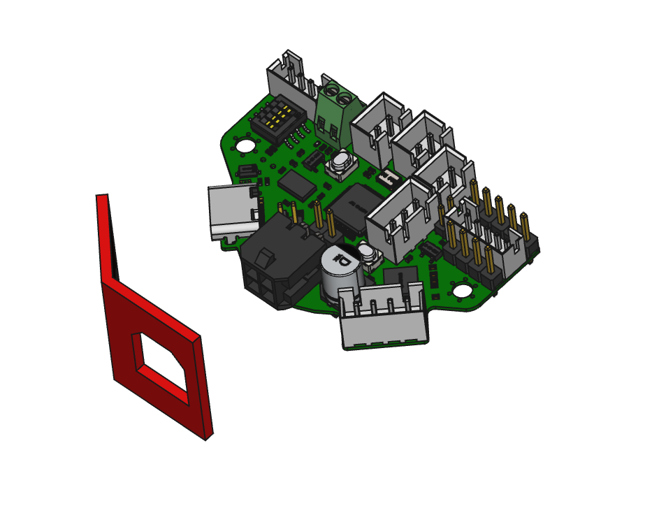
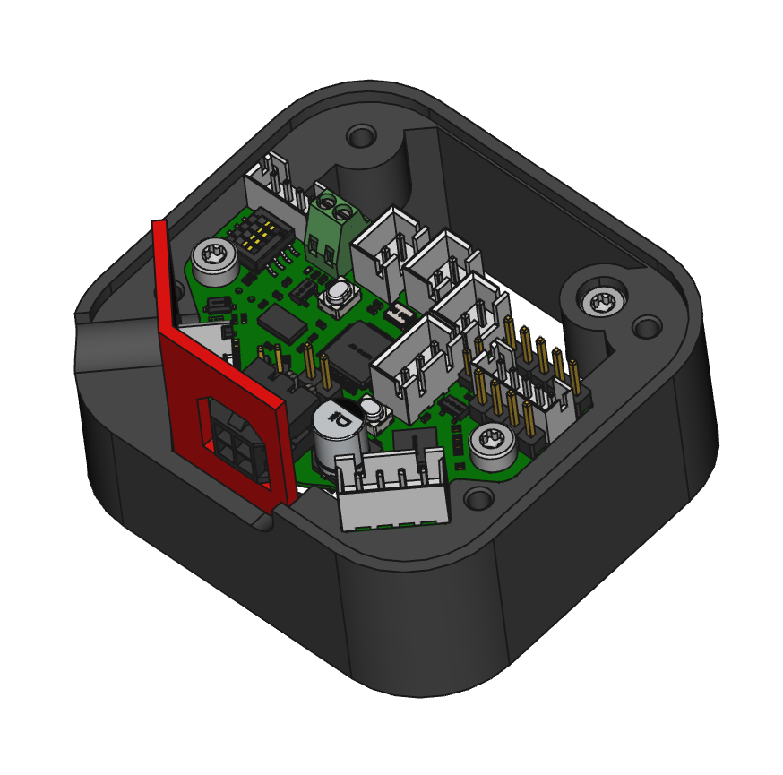
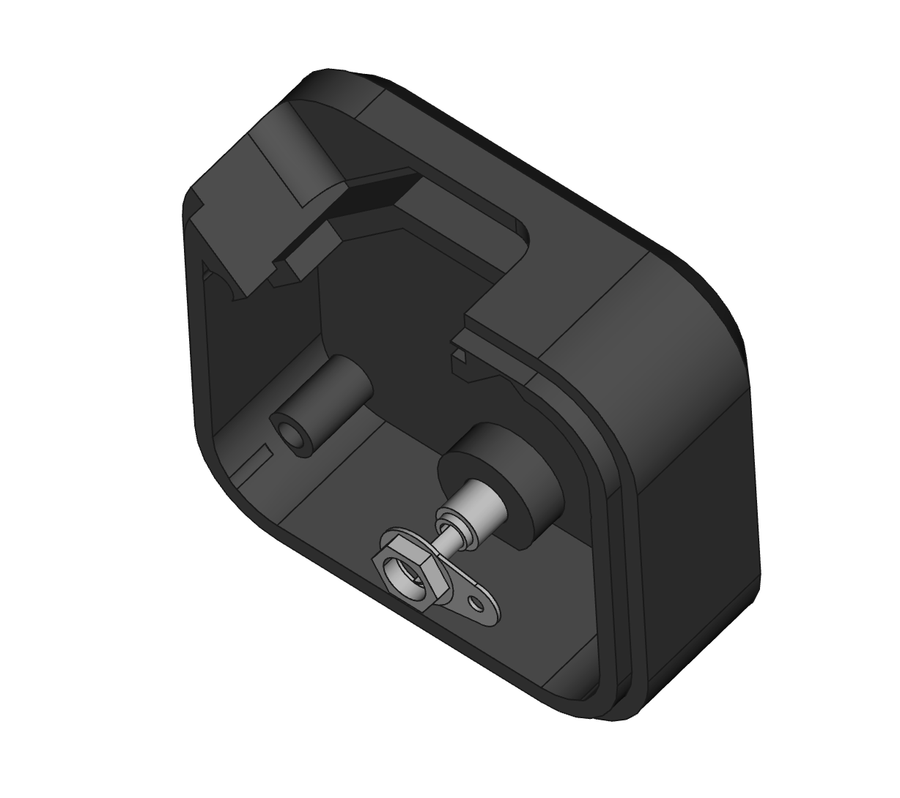
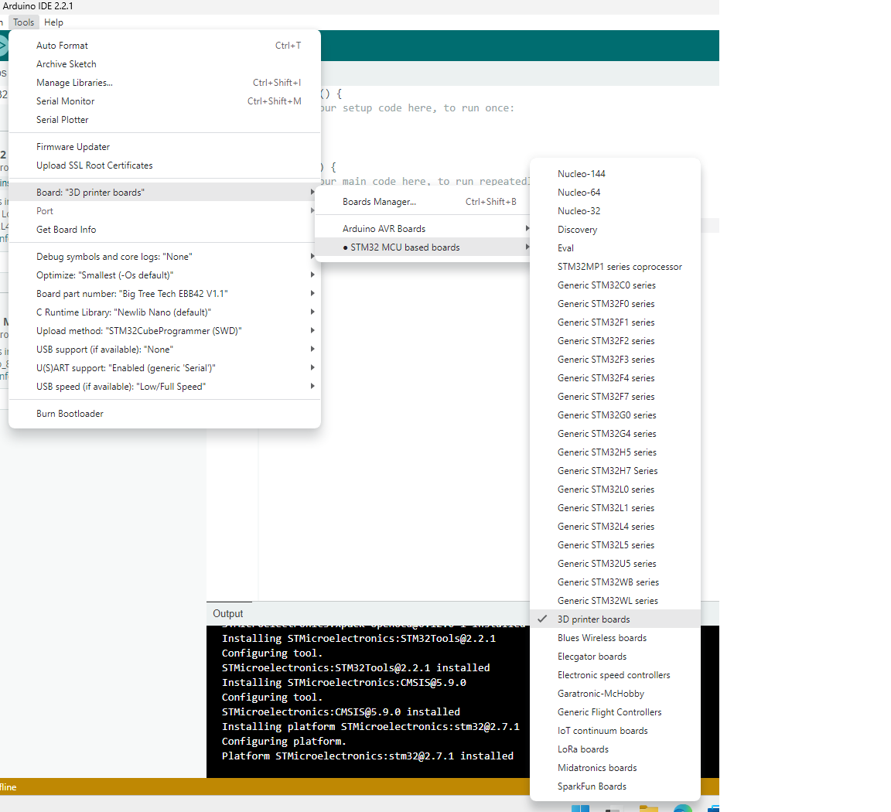

# Realta Scope Tech EBBfocuser

## Project goals.

+ Truley open source code i.e. do what you want with it.
+ Using open hardware only i.e. schematic available.
+ Firmware created using Arduino IDE with full guide to get it working with the EBB.

## What you need to buy.

### Stepper motor

I have used a 23mm thick Nema 17 stepper motor like this 17HS4023. 

However, any NEMA stepper motor thicker than this will work but you are limited to 1.5A per phase by the EBB42 stepper motor driver. Even thinner motors will work but you will have a hard time mounting them as the case will foul most mounting brackets. The FreeCAD file containing the parts is included in this repository so can be edited to provide a spacer to pad out the difference in width if needed. 

### BigTreeTech EBB36 

There are two versions of this, one with an accelerometer and one without, both will work but the accelerometer version is twice as expensive and no use of it is made in this project. 

### M3 Hex bolts

To secure the EBB36 you will need 4 25mm long M3 bolts and 2 5mm M3 bolts while the ones for the stepper motor depend on how thick the one you buy is. The original bolts will not reach through the combined thickness of the case and motor so you will need 2 replacement ones. I found that for the 23mm thick motor I could use 22mm long bolts.  

### Optional: RCA connectors

If you want to use the dew heaters then you will need these RCA connectors.

### Optional: Crimping tools and ferrules

The EBB36 focuser comes with all the accessories you need to connect it up it comes with the cable fittings needed to be added to wires to fit in its sockets and the metal pins too. However you will need to crimp these onto the wires yourself and a dupont compatable crimping tool greatly helps.

However it is possible to crimp using Needle Nose Pliers. 

I also made use of ferrules for terminating the dew heater wires used in the screw terminals.

## What you need to 3D print.

None of the parts need supports and they were designed to be printed easily on a printer using an 0.8mm nozzle so should be easy prints on any printer using a smaller nozzle. 

### Notes on filament type.

Stepper motors will get warm when opperating and even when not moving they are being held in place by powered magnetic fields. They are designed to cope with very very high temperatures. The firmware provided does make use of the TMC2209's CoolStep technology which greatly lowers the current drawn when not moving however the motor will still get warm to the touch, around 40c to 50c are common. This means you really should think twice about using a filament such as PLA which will start going floppy around this temperature. PETG would be better but ABS or ASA would be best. 

## Assembling the case.

### Step 1: RCA Connectors (Optional)

Cut two sets of wires to 8cm in length. I have used silicone wire as its extremly flexible. I have used 22AWG wire, you need to check what amperage your dew heaters take and also note that the RCA connectors themselves are only rated to 2 Amps. Most modern dew straps use way less than 1 Amp unless they are very large.

Dew straps are really just large resistors this means that there is no need to worry about polarity however most (all?) dew heaters on the market make the center pin positive and the outer negative so I have continued that here. 

Why RCA connectors for dew heaters? Lol no idea but thats what the ones sold today use!

### Shorten the stepper motor wires

Todo: Warning about checking the wiring order.

Todo: Reminder about crimping

Todo: Suggested length.

### Heat set inserts

### Insert NEMA 17 stepper motor

### Postion Face Plate

### Fit EBB36 PCB

### Fit RCA connector

## Setting up the Ardunio IDE for use with EBB36.

### Install the Arduino IDE.

The latest Ardunio IDE can be found here.

https://www.arduino.cc/en/software

When you start the IDE for the first time you will be asked to allow it access to the internet, please allow it to do this as it will download various drivers and you will need this functionality later on to install some libaries. 

### Add additional Boards Managers URLs

Go to file -> preferences and add stm32duino

and add 

https://github.com/stm32duino/Arduino_Core_STM32/wiki/Getting-Started to the "additional Boards Managers" section at the bottom. Wait for the definitions to download

### User board manager to add stm32duino

Use the "tools" -> Board manager menu at the top to add the STM32 boards to the IDE.

This opens a panel on the left hand side, in this search for "STM". 

### Select the and configure the board

Use the "tools" menu again to select "3D printer boards"; 

tools -> STM32 MCU based boards -> 3D printer boards

Then use the newly added menus to select the board part number 

And upload method

Finally the board is ready to be used in Arduino IDE!

### Install STM32CubeProgrammer

We still aren't done installing software, when the Arduino IDE uploads the file to the EBB42 board it will first try to compile it and when it does that it reaches out to the STM32 compiler which wont exist yet on your computer! In order for this to work we need to install STM32CubeProgrammer which can be downloaded from.

https://www.st.com/en/development-tools/stm32cubeprog.html

### Adding in required linbraries.

Add picture of menu option

Add search

Need only TMCStepper? 

### Download and Unzip Realta EBB42 telescope focuser repository

Show image of download link

Show unzip a file

### Compiling and uploading source files using Ardunio IDE.

Show tick and arrow 

describe difference

Show how to set EBB42 into programming mode.

### Alternatively uploading pre-compiled binaries using STMCubeProgrammer software.

Can just open bin file and upload it using STMCubeProgrammer, still need to set EBB42 into programming mode.

## Compiling ASCOM driver from source code.

### Download Visual Studio Community

Visual studio comunity is a free version of visual studio

https://visualstudio.microsoft.com/downloads/

Clicking the "Free download" button will take you to another site that will automatically start downloading the application. As its a ".exe" file your web browser might ask for your permission.

When VS studio Community starts to install it will ask you questions about what you want to use it for, answer x, y, x

### Run as administator

Explain its a DLL and need to be admin to register it in windows

### Open project

In the earlier step you downloaded the Realta EBB42 telescope focuser repository, the VS project is located in that repository in folder XYZ, open the file named todo_file_name.

### Configure for "Any CPU"

Who how to change to "Any CPU" compiler. Todo need to check this actually works for a fresh install otherwise ask to compile for x64 unless they know they are running an older CPU. 

### Rebuild project

Show screen shots of rebuilding.

### Alternatively using pre-compiled ASCOM driver installer.

## How to use ASCOM driver (Using N.I.N.A).

## Notes about INDI linux driver.

Lol I don't know how!
