Todo: Better blurb at start

Todo: Makesure SLT files are oriented correctly.

Todo: Blurb for each code section.

Todo: Table of commands and expected inputs.

# Realta Scope Tech EBBfocuser

## Project goals.

+ truly open source code i.e. do what you want with it.
+ Using open hardware only i.e. schematic available.
+ Firmware created using Arduino IDE with full guide to get it working with the EBB.

## What you need to buy.

### Stepper motor

I have used a 23mm thick Nema 17 stepper motor like this 17HS4023. 

However, any NEMA stepper motor thicker than this will work but you are limited to 1.5A per phase by the EBB36 stepper motor driver. Even thinner motors will work but you will have a hard time mounting them as the case will foul most mounting brackets. The FreeCAD file containing the parts is included in this repository so can be edited to provide a spacer to pad out the difference in width if needed. 

### BigTreeTech EBB36 

There are two versions of this, one with an accelerometer and one without, both will work but the accelerometer version is twice as expensive and no use of it is made in this project. 

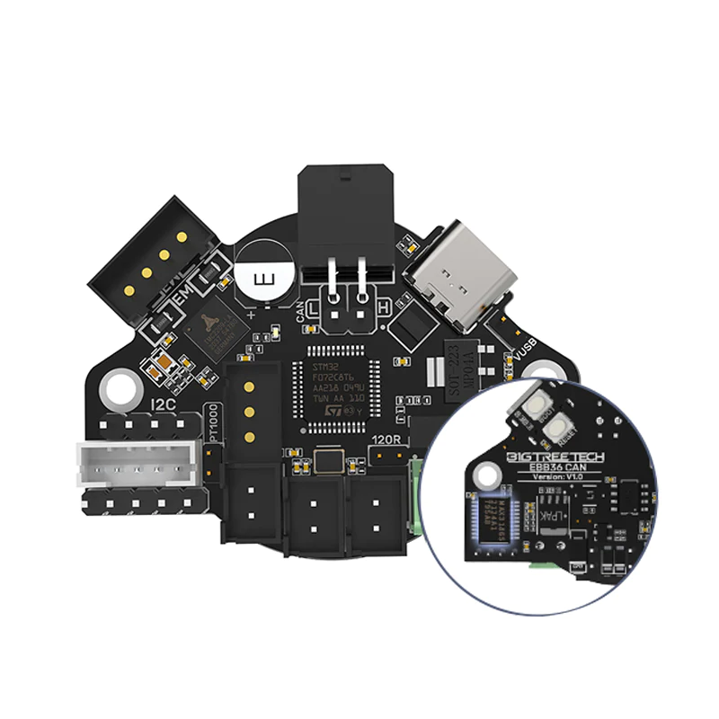

### Note about the EBB42

Originally this project was built around the EBB42 kit sold by big tree tech however we changed the design to use the EBB36 for two reasons; 

1) The PCB is smaller allowing for a smaller sized case and
2) The power connector while smaller is of a more common type so should be easier to source replacements for.

All of the software provided here will work just fine with the EBB42 but you will need to design your own case for it.

### M3 Hex bolts

To secure the EBB36 you will need 

4 25mm long M3 bolts to secure the top of the case

2 6mm M3 bolts to secure the PCB

2 to secure the stepper motor and their length depends on how thick the stepper motor is, the original bolts 
will not reach through the combined thickness of the case and motor so you will need 2 replacement ones. I found that for the 23mm thick motor I could use 22mm long M3 bolts, which is unfortunatly not that common a size but Amazon sellers did have them. 

Please note I found it very easy to damage the screws these motors come with so please make sure you use an appropriately sized scew driver before attempting to remove them. 

### Optional: Crimping tools and ferrules

The EBB36 focuser comes with all the accessories you need to connect it up, it comes with all the cable fittings needed. However you will need to crimp these onto the wires yourself and a dupont or similar crimping tool greatly helps.

However it is possible to crimp using Needle Nose Pliers. 

It can also be a good idea to use ferrules for terminating the dew heater wires used in the screw terminals.

One kit will get you enough connectors to last a lifetime. 

### Power connector

The EBB36 comes with a power connector that needs to be crimped onto a power cable of somekind. Below are some examples.

I use the Anderson Power Pole connector in a victim cable configuration so that the Anderson connector receives the brunt of being plugged and unplugged as the connector on the PCB isn't really designed for that. I would however recommend cutting an existing cable for beginners because Anderson Power Poles are expensive and the DIY connectors sold on Amazon and the like need soldering and are fairly flimsy. 

## What you need to 3D print.

The parts are designed to be printed easily on a printer using a 0.8mm nozzle so should be easy prints on any printer using a smaller nozzle. 

The bottom section of the case needs supports to print well, I used the support paint tool and the smart fill option to select the faces needing supports using Prusa Slicer.

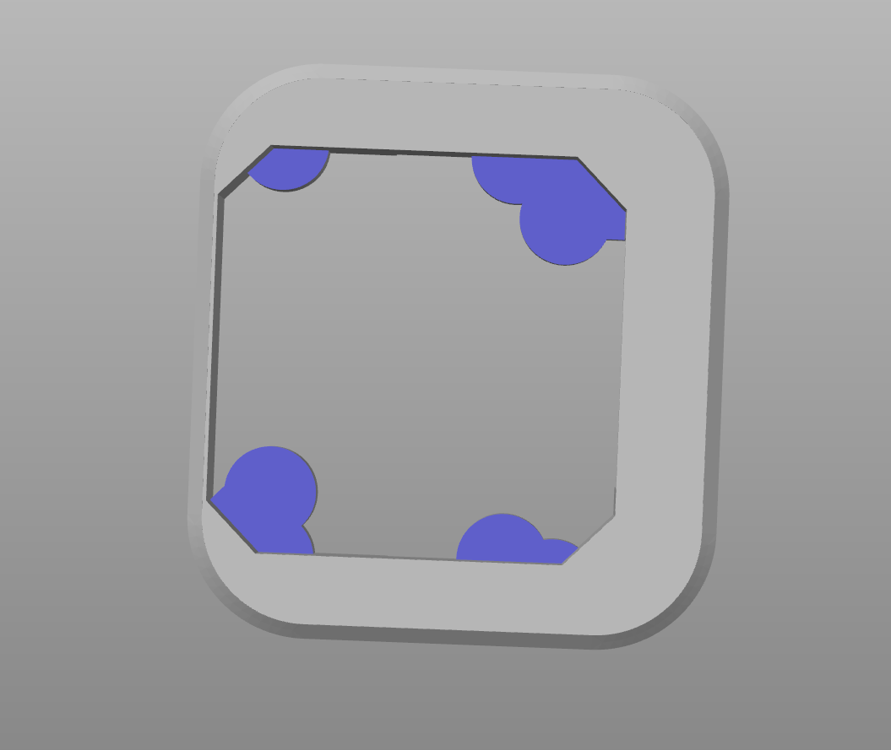

### Notes on filament type.

Stepper motors will get warm when operating and even when not moving they are being held in place by powered magnetic fields. They are designed to cope with very very high temperatures. The firmware provided does make use of the TMC2209's CoolStep technology which greatly lowers the current drawn when not moving however the motor will still get warm to the touch, around 40c to 50c is common. This means you really should think twice about using a filament such as PLA which will start going floppy around this temperature. PETG would be better but ABS or ASA would be best. 

## Assembling the case.

In this section we will cover the step by step assembly of the motor and case

### Shorten the stepper motor wires

The stepper motor you purchased probably came with a four wire cable with red, blue, green and black cables. However this cable will be far too long. It needs to be shortened to 70mm and this will require either cutting and resoldering the wires or recrimpling the connectors, most motors that are available on the webb will either have fixed wiring at the motor end or use a wider 6 pin connector, in the case of two connector motors measure from the larger connector as the EBB36 PCB kit will come with spare connectors and housings.

Stepper motors like these are designed to work with four wire two phase motors. The phases for the motor will be named A and B and a pair of wires will be used with each phase, the documentation for your stepper motor will sometimes tell you which colour wires go with each phase but there appears to be no standard colours for wiring so you should test the wires to see which go together if possible. To do this you can use a multimeter as matching pairs will show continuity.

 "EZTip #4 - Testing and Checking your Stepper Motors")

If you can't test the wires its not the end of the world if they get mixed up the motor will just jitter around and move ineffectively and you just need to swapped two of the wires around in the connector housing.

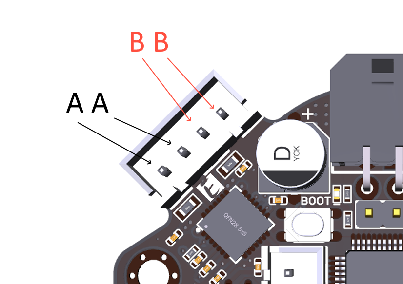

The image above shows how the EBB36 PCB expects you to connect the phases, it doesn't matter that you connect AA from your motors documentation to AA on the header just that you keep both wires of each phase seperate from the others, swapping the order just reverses the direction of movement. The cables that came with my stepper motors had the pin order ABAB so I had to flip the two middle wires over.

### Remove two screws from the stepper motor

The case is mounted to the stepper motor using its own case mounting screws just using the longer replacement ones discussed earlier. The two screws that need removing are shown below. 

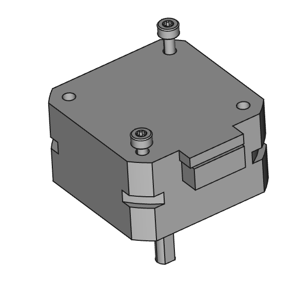

### Insert NEMA 17 stepper motor

The stepper motor will fit into the bottom half of the case when inserted at an angle.

Make sure its wires are connected and to feed them through to the other side of the case.

Mount the case using the repacement bolts as shown below

Do not over tighten these (or any other bolts) just a moderate hand tighting will do.

### Postion Face Plate

The case face plate needs to be positioned over the USB-C port and power connector before fitting to the case.

### Fit EBB36 PCB

### Insert motor wire connector

The wire connector from the motor can now be connected to the PCB as shown below.

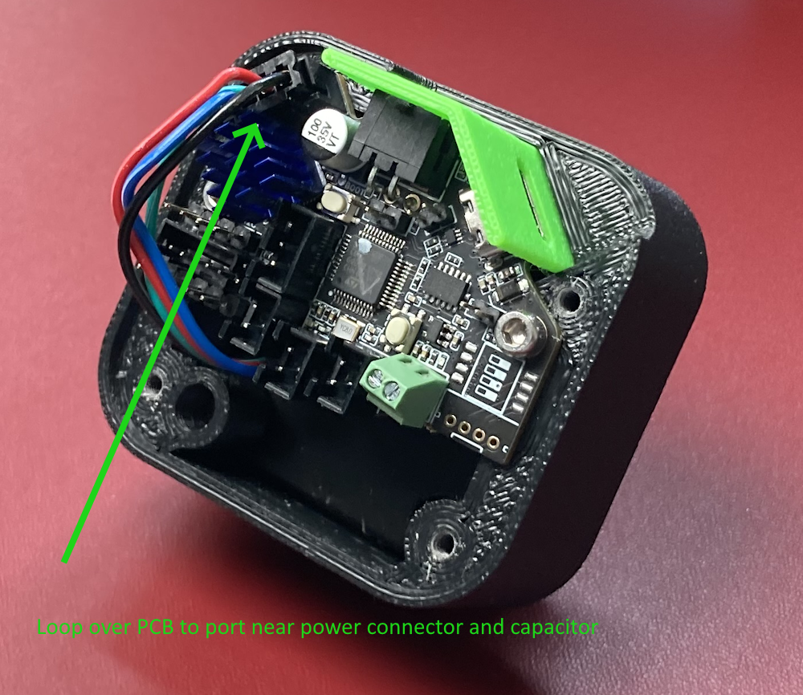

### Fit top of case

Use two 10 mm hex bolts to screw the PCB into position. Do not over tighten.

### Connect to your PC.

Connecting the EBB36 to your PC with a USB C cable will initially do nothing. The EBB36 is by default configured to use only power coming from its power connector, this power can range from a voltage of between 12v and 24v. So you need to connect both cables and make sure the power cable is powered. The default behaviour can be changed using one of the supplied jumpers however this is not recomended for this application.

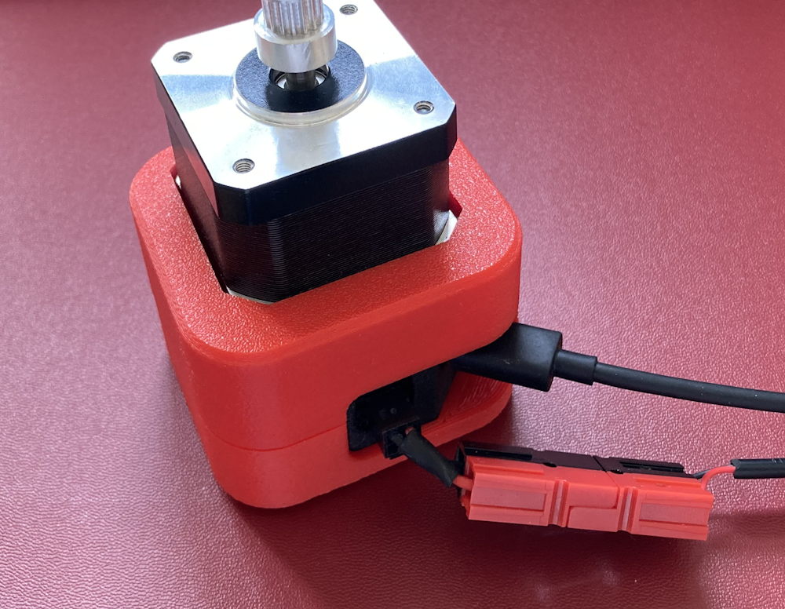

## Setting up the Arduino IDE for use with EBB36.

### Install the Arduino IDE.

The latest Ardunio IDE can be found here.

https://www.arduino.cc/en/software

When you start the IDE for the first time you will be asked to allow it access to the internet, please allow it to do this as it will download various drivers and you will need this functionality later on to install some libaries. 

### Add additional Boards Managers URLs

The EBB36 doesn't use a microcontroller of a type used by any of the boards supplier by Arduino so we need to download additional board definitions. This can be done using the Arduino IDE itself. 

Go to file -> preferences and add stm32duino

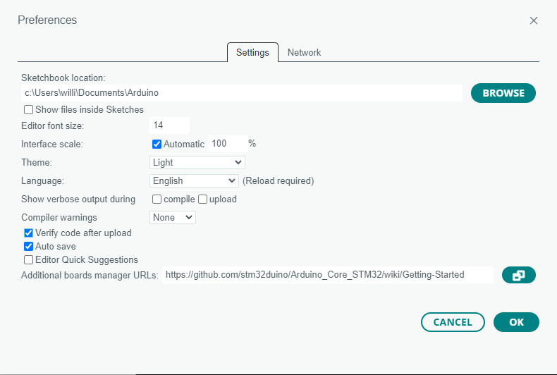

and add https://github.com/stm32duino/Arduino_Core_STM32/wiki/Getting-Started to the "additional Boards Managers" section at the bottom. Wait for the definitions to download

### Edit the configuration

As at the time of writing this guide (June 2024) the board definitions for the EBB36/42 do not allow you to use the micro controllers flash memory, not sure why this is as all thats needed is a simple configuration change. 

You need to use file explorer to go open a file in the following impossibly long directory

"%LocalAppData%\Arduino15\packages\STMicroelectronics\hardware\stm32\2.3.0\variants\STM32G0xx\G0B1C(B-C-E)(T-U)_G0C1C(C-E)(T-U)"

The file that needs editing is variant_EBB42_V1_1.h, its likely your PC doesn't have an application associated with this file type but its really just a text file so can be opened just fine in notepad.

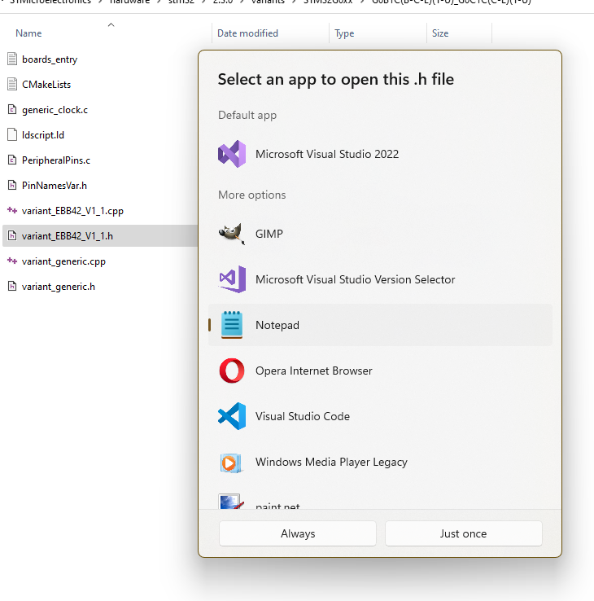

Once opened we need to add one line of text, #define FLASH_BANK_NUMBER	FLASH_BANK_1, as shown below.

Please note that forgetting this step will lead to some confusion later on as the arduino code will compile and upload just fine but will not work correctly in practice as it will never remember its position.

### User board manager to add stm32duino

Back in arduino IDE use the "tools" -> Board manager menu at the top to add the STM32 boards to the IDE.

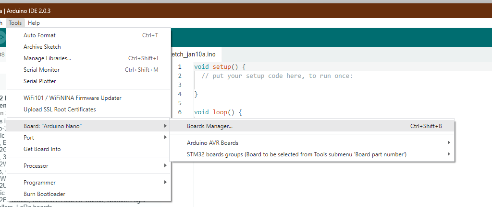

This opens a panel on the left hand side, in this search for "STM". 

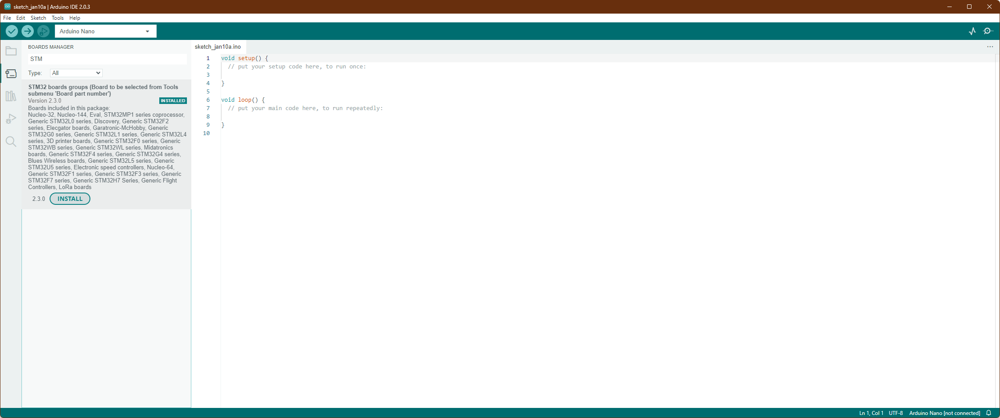

### Select and configure the board

Use the "tools" menu again to select "3D printer boards"; 

tools -> STM32 MCU based boards -> 3D printer boards

Then use the newly added menus to select the board part number, the Big Tree Tech EBB42 uses all the same hardware and connections just on a slightly larger PCB. 

And upload method

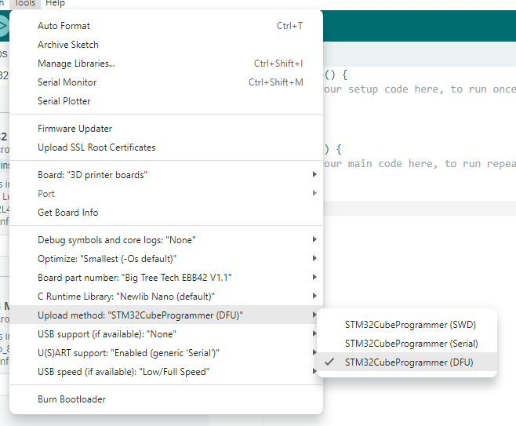

Finally the board is ready to be used in Arduino IDE!

### Install STM32CubeProgrammer

We still aren't done installing software, when the Arduino IDE uploads the file to the EBB42 board it will first try to compile it and when it does that it reaches out to the STM32 compiler which wont exist yet on your computer! In order for this to work we need to install STM32CubeProgrammer which can be downloaded from.

https://www.st.com/en/development-tools/stm32cubeprog.html

### Adding in required libraries.

In order to comunicate with the TMC2209 stepper driver on the EBB36 PCB we need computer code, we didn't write this fully ourselves we got some help and used a library that was written by teemuatlut, here's a link to his projects github https://github.com/teemuatlut/TMCStepper however you won't need to download anything from there as we can do that via the Arduino IDE itself. 

To do this we use the manage libraries function from the Sketch menu option

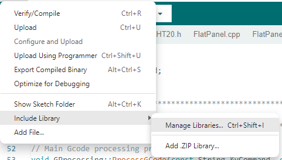

Type TMCStepper into the search box and then install the latest version.

The console in the bottom right will show success when installation is successful. 

Now arduino IDE is fully ready to be used to program the EBB36!

### Download and Unzip the Realta-EBBfocuser repository

Now we need to download the code and other files in this repository, on the main page there is a green "<> Code" button.

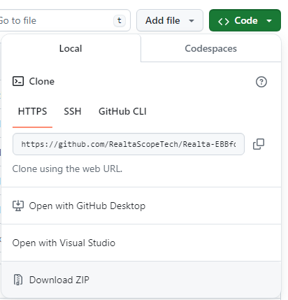

clicking it will give you the oprion to download a zip file, click that. This will result in a zip folder appearing in your downloads folder, right click on that an choose "Extract All..."

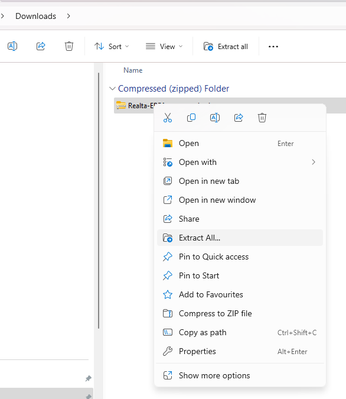

This will show a dialog box asking you where to unzip the file, leave the defaults but do click the "Shpw extracted files when complete" and click the "Extract" button.

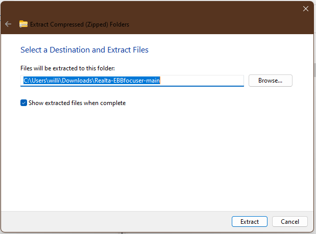

This should open a window showing a file structure similar to the image below.

> [!WARNING]  
> One thing that might happen here is that Windows defender might decide that one of these files is a virus.
> The file in question is the ASCOM driver installer and dealing with this will be discussed in a later section.
> This has been a source of frustration for us and we have submitted a false positive investigation to Microsoft. It seems to come from the Inno installer software and not the driver itself which is the installer recommended by the ASCOM team.  

### Compiling and uploading source files using Ardunio IDE.

Go to the folder 

"%UserProfile%\Downloads\Realta-EBBfocuser-main\Realta-EBBfocuser-main\Arduino\EBBTelescopeFocuser" 

and double click "EBBTelescopeFocuser.ino"

 

We are now ready to upload the arduino code to the EBB36 however we must first put the EBB36 into upload mode. Connect the EBB36 to your computer using a suitable cable and connect it to a 12v power source. You should here your computer beep when its connected. 

Once this id done the EBB36 can be put into upload mode by pressing two buttons on the PCB, you can do this either by removing the case or using two tooth picks and a little trial and error.

 

You need to press and hold the button closest to the port panel and then click the other button once and release both. You should here a beep again as the device disconnects again.

Now that is done back in Arduino IDE we need to click the "upload" arrow button in the top left.

Once clicked the arduino code will be first compiled and then uploaded to the focuser. The first time you do this it can take a while as the STM32CubeProgrammer from earlier is silently opened in the background. 

When the code is successfully uploaded you will get an output at the bottom of the arduino window something like below.

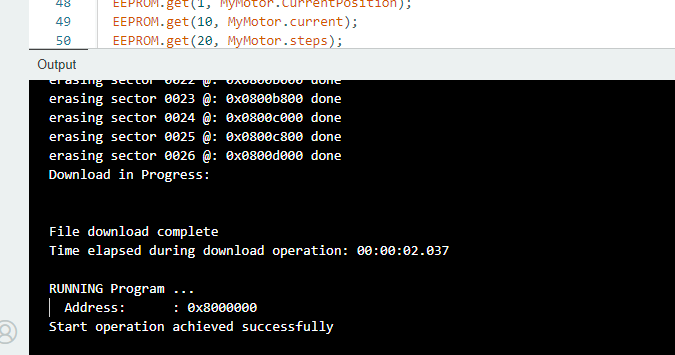

You will hear another beep as the device reconnects to the PC. 

### ASCOM

For any of this to work we need to install the "Astronomy Common Object Model" or ASCOM, this is a set of API specifications that make it easy for different vendors products talk to other vendors software. You can download it from this link.

https://www.ascom-standards.org/Downloads/Index.htm

Install it and move on to the next step.

### ASCOM driver installer.

The windows ASCOM driver can be found in folder

"%UserProfile%\Downloads\Realta-EBBfocuser-main\Realta-EBBfocuser-main\ASCOM driver"

double clicking "Realta EBB focuser Setup.exe" will install the driver.

However, there are quite a few things that can go wrong here!

The first is that Windows could see the drivers installer as a virus. In order to resolve this you need to go into the "Virus & threat protection" section of Windows settings and choose "Protection history"

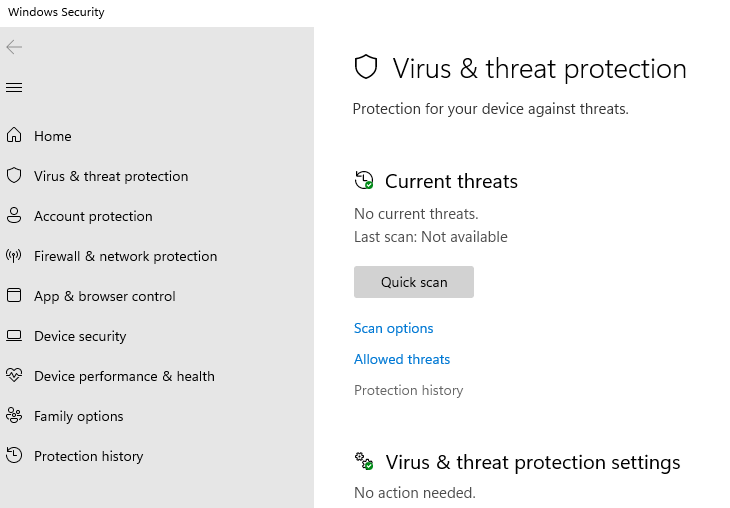

Then you need expand the most recent "Threat quarantined" section and in the bottom section "Actions" choose "Restore".

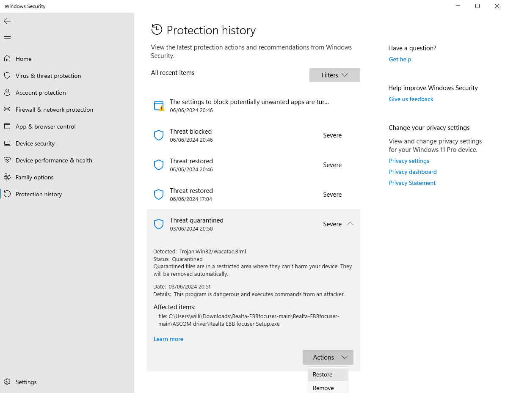

As stated earlier we have submitted a false detection request to Microsoft.

Even once past this issue Windows will now decide that the software is suspect because its not security signed. Double clicking the file will get you a warning like the following.

Clicking the "More info" text will make a new button appear "Run anyway" appear, clicking that will finally allow you to install the driver.

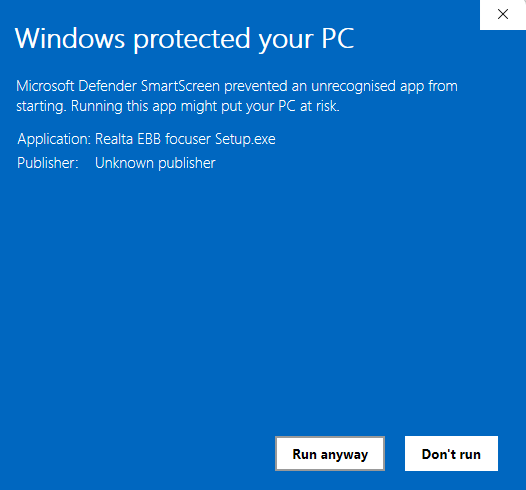

Click accept agreement and then next.

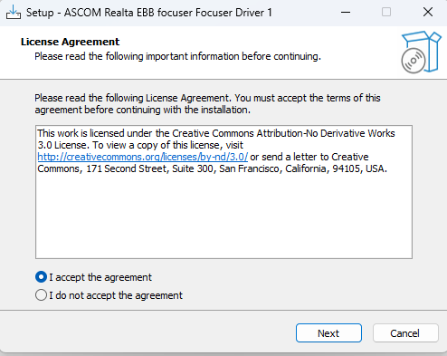

If this is all too much for you to trust, and who can blame you, you can instead compile the driver using Microsoft Visual Studio community eddition.

https://visualstudio.microsoft.com/vs/community/

Windows defender does not complain about that at all. Details of whats needed to do this can be found in the visual studio section of this github repository.

Guide to compiling the Visual Studio project [Guide to compiling the Visual Studio project](Visual Studio/README.md)

Its unlikely we will be able to get this driver install file signed as that costs money and this is just a fun open source project.

## How to use ASCOM driver (Using N.I.N.A).

Now that you have all the software installed you can start using the focuser. In order to use it you need telescope control software. In this section I am going to use N.I.N.A as the software. 

https://nighttime-imaging.eu/

Opening the settings menu is needed because the port the focuser is connected to needs to be selected.

If you are lucky there will be only one option to choose from, but on our PC there is a built in COM port for controling RGB lights of all things!

If its not clear what port to choose you can working out by using windows device manager (right click the start menu button) expanding the "Ports (COM & LPT)" section and unpluging the focusers USB cable from your PC, the comport should disappear from the list.

Once selelcted click ok, this will close you out of the settings window and now you need to click the "connect" button that looks like a power icon. 

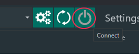

This will connect you to the focuser and the information on the screen should change to the following.

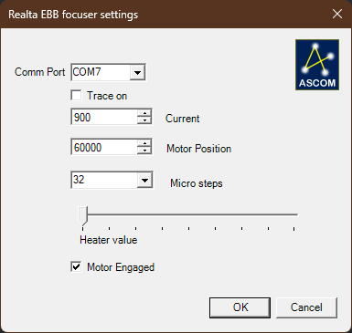

Here is a pretty good guide to setting up a focuser we found on Youtube, its for a different focuser but the idea is the same.

