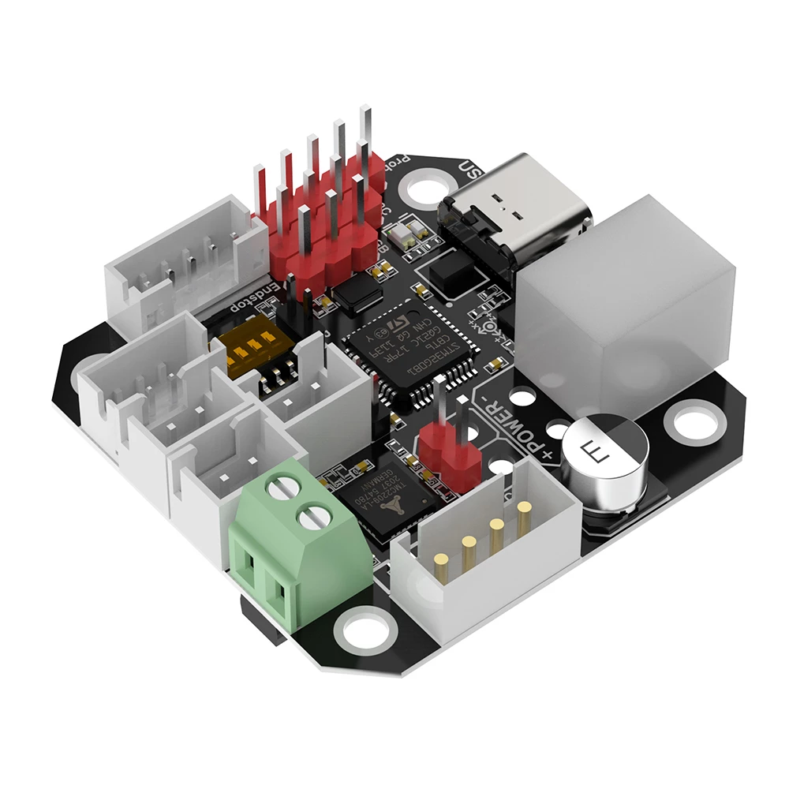
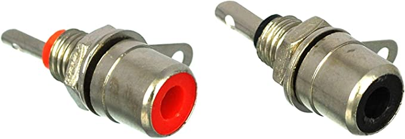
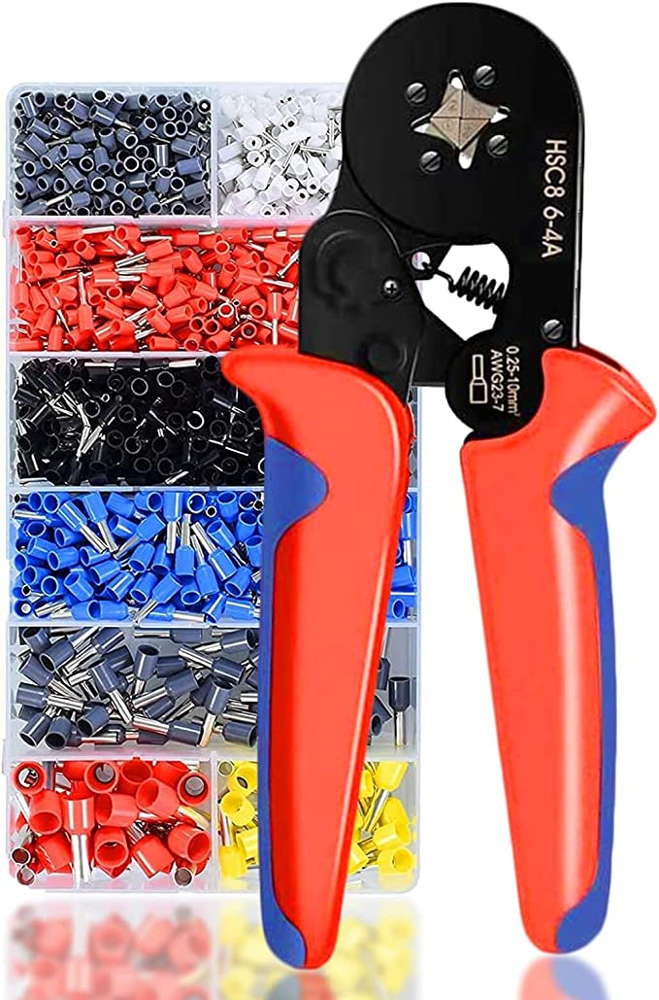

# Realta Scope Tech EBB42 telescope focuser

## Project goals.

+ Truley open source code i.e. do what you want with it.
+ Using open hardware only i.e. schematic available.
+ Firmware created using Arduino IDE with full guide to get it working with the EBB42.

## What you need to buy.

### Stepper motor

I have used a 23mm thick Nema 17 stepper motor like this. 

However, any NEMA stepper motor thicker than this will work but you are limited to 1.5A per phase by the EBB42 stepper motor driver. Even thinner motors will work but you will have a hard time mounting them as the case will foul most mounting brackets. 

### BigTreeTech EBB42 

There are two versions of this one with an accelerometer and one without, both will work but the accelerometer version is twice as expensive and no use of it is made in this project. 

### Optional: RCA connectors

If you want to use the dew heaters then you will need these RCA connectors.

### Optional: Crimping tools and ferrules

The EBB42 focuser comes with all the accessories you need to connect it up it comes with the cable fittings needed to be added to wires to fit in its sockets and the metal pins too. However you will need to crimp these onto the wires yourself and a dupont compatable crimping tool greatly helps.

However it is possible to crimp using Needle Nose Pliers. 

I also made use of ferrules for terminating the dew heater wires used in the screw terminals.

## What you need to 3D print.

## Assembling the case.

### RCA Connectors

### Fitting PCB

Setting up the Ardunio IDE for use with EBB42.
1. Install Ardunio IDE
2. User board manager to add stm32duino
  If still version 2.3.0 then extra steps
   1. Install GIT
   2. Go to folder. "%LocalAppData%\Arduino15\packages\STMicroelectronics\hardware\stm32"
   3. Delete file named "2.3.0"
   4. git clone https://github.com/stm32duino/Arduino_Core_STM32.git 2.3.0
3. Adding in required linbraries.
4. Install STM32cube
5. Adding in required linbraries.
6. Compiling and uploading source files using Ardunio IDE.
7. Alternatively uploading pre-compiled binaries using STMCubeProgrammer software.
8. Compiling ASCOM driver from source code.
9. Alternatively using pre-compiled ASCOM driver installer.
10. How to use ASCOM driver (Using N.I.N.A).
11. Notes about INDI linux driver.
