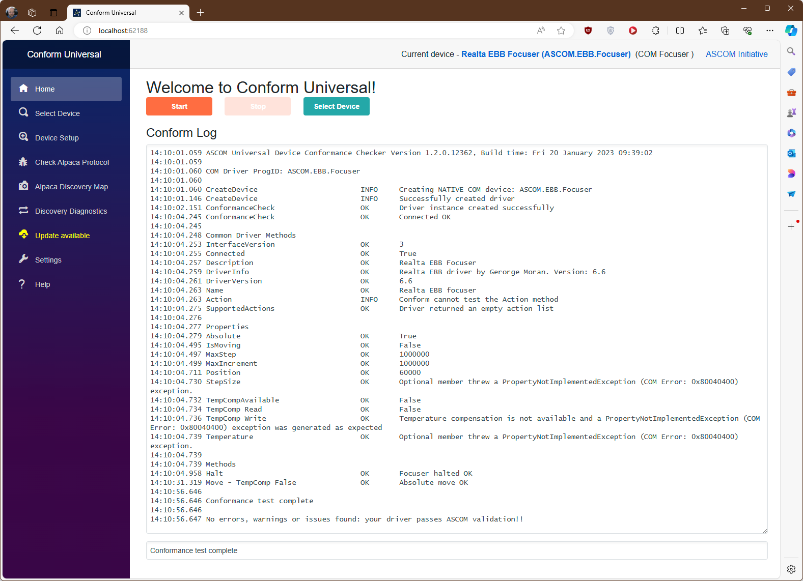
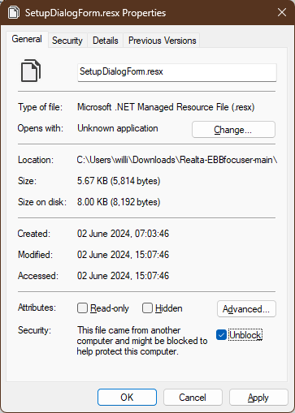
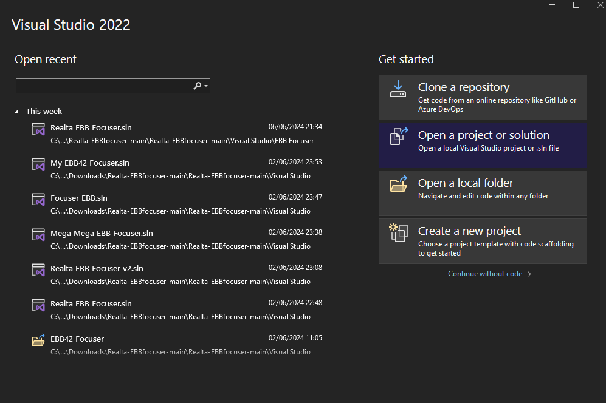
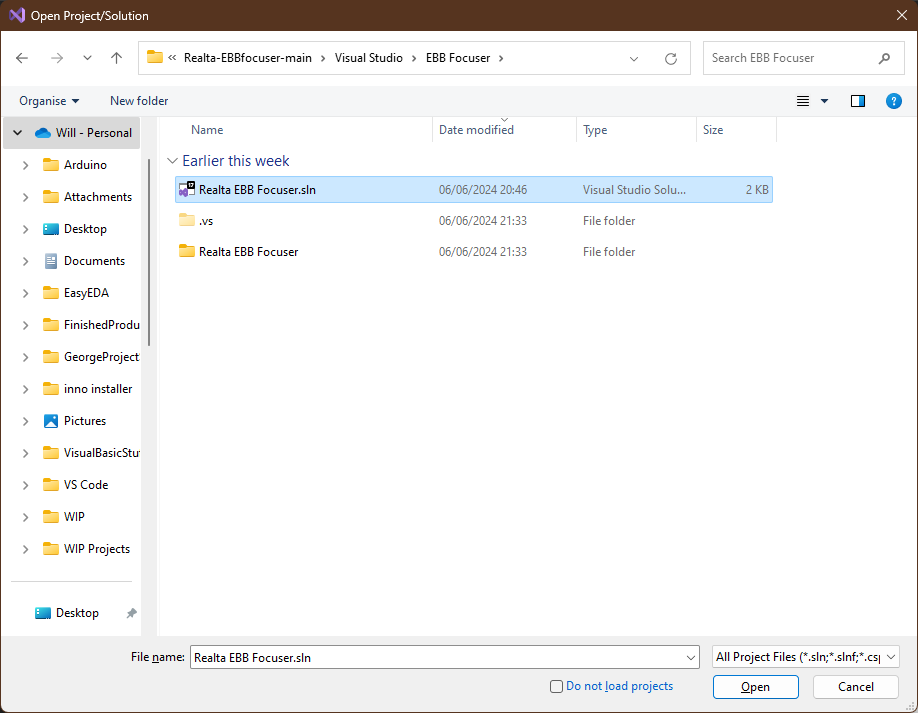

# Overview of Visual Studio project

Uses VB.net

Edited code template provided by ASCOM (https://www.ascom-standards.org) to add the required G commands for the focuser, and added additional elements to the settings form.

# ASCOM compliance test

# How to open and compile VS project.

In order to compile and use this code you need to have Visual Studio installed on your PC, the community edition works just fine for this.

https://visualstudio.microsoft.com/vs/community/

After that is installed you need to edit two of the downloaded files.

"%UserProfile%\Downloads\Realta-EBBfocuser-main\Realta-EBBfocuser-main\Visual Studio\EBB Focuser\Realta EBB Focuser\SetupDialogForm.resx"

and

"%UserProfile%\Downloads\Realta-EBBfocuser-main\Realta-EBBfocuser-main\Visual Studio\EBB Focuser\Realta EBB Focuser\My Project\Resources.resx"

For each of these files you need to right click on them, choose "properties" and tick the "Unblock" tick box in the bottom right. 

Compiling this project in debug mode will create and register a COM object for windows/ASCOM to use. In order to do this Visual Studio needs to be run in Admin mode. To do this click on start menu and start typing "Visual", the icon for Visual studio should appear, right click on this and choose "Run as administrator".

This should bring up a "Get started" window and we want to choose "Open a project or solution"

Navigate to "%UserProfile%\Downloads\Realta-EBBfocuser-main\Realta-EBBfocuser-main\Visual Studio\EBB Focuser"

And open file "Realta EBB Focuser.sln"

At the top of the window there are two drop down menus, these need to be set to "Debug" and "x64" if running 64bit windows or "x86" for 32bit windows. 

Choosing release will compile the project just not register the COM object so you won't be able to use it.

Now from the "Build" menu chose "Rebuild solution".

You should see a success message something like below.

# Future plans/changes

The vb.net program uses a custom method to block parallel access to the serial connection to the stepper motor, it probably should use mutex's but I couldn't get them working with the ASCOM framework provided. However I would prefer to work on a C# version of the driver and implement the mutex there.

